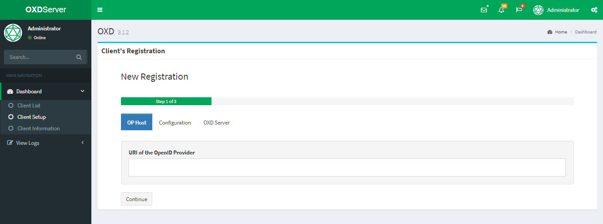
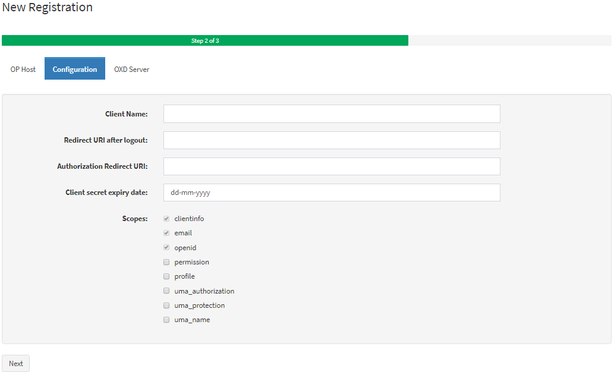
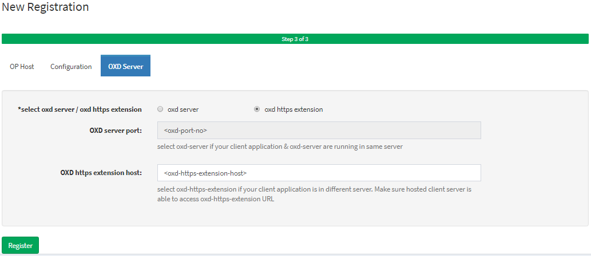
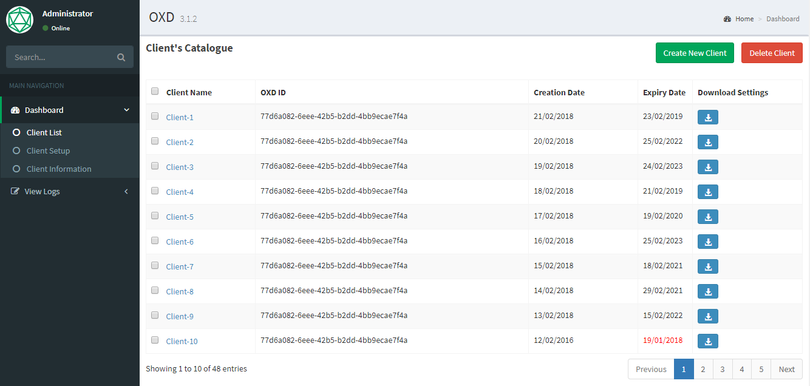
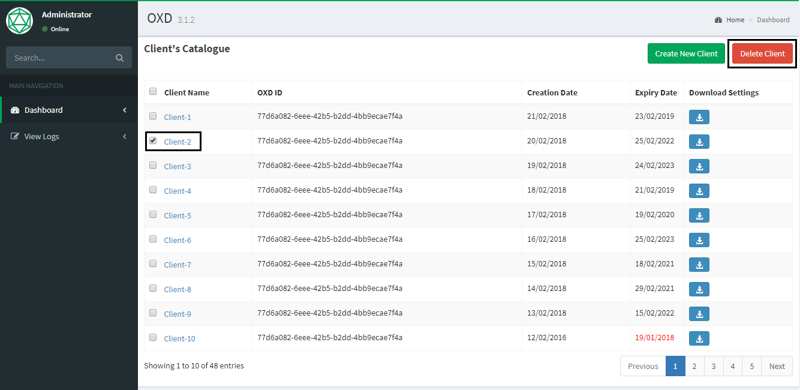
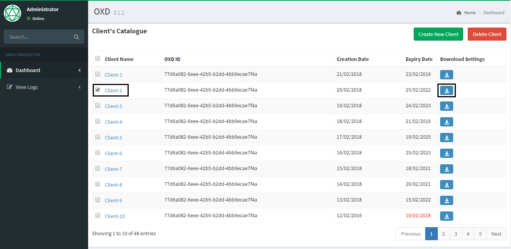
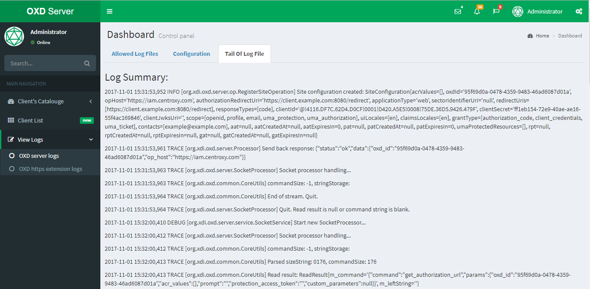

# Proposal for oxd UI
 
## TABLE OF CONTENTS

1.	Introduction
    1.	Problem Statement
    2.	Objective
2.	Proposed Approach
    1.	Register / Setup Client Application
    2.	List Client Application
    3.	Remove Client Application
    4.	Export Client Application Settings
    5.	View oxd server / oxd https logs
    6.	Expected Project Results

## INTRODUCTION

The purpose of the document is to create an UI inbuilt with oxd server which will allow admin to `Setup` / `Update` / `Remove Client` Applications in/from `oxd server`. This functionality will help user to avoid implementing `Setup Client` / `Update Site` registration and `Remove Site` method inside client application.

###	PROBLEM STATEMENT

    |------------------------------|--------------------------------------------------------------------------|
    |ELEMENT                       |DESCRIPTION                                                               |
    |------------------------------|--------------------------------------------------------------------------|
    |The problem of ...            |Currently in oxd 3.1.2 there are 11 methods a developer need to implement |
    |                              |in application to Use `oxd server`.                                       |
    |                              |Out of the 11 methods in oxd, there are 4 methods (Setup client, Register |
    |                              |Site, Update Site,  Remove Site) which are only required for setting up or| 
    |                              |removing client application from `oxd server`. An organization having 10  |
    |                              |Web applications, need to implement these 4 methods in each application.  |
    |                              |This process is a time consuming process for the Developers.              |
    |------------------------------|--------------------------------------------------------------------------|
    |Affects ...                   |Developers and Client Applications                                        |
    |------------------------------|--------------------------------------------------------------------------|
    |And results in ...            |Write unnecessary redundancy code and complexity                          |
    |------------------------------|--------------------------------------------------------------------------|
    |Benefits of a solution ...    |1. User does not need to write code to implement `Setup Client`,          |
    |                              |   `Update Site`, `Register Site`, `Remove Site`                          |
    |                              |2. A centralized page to manage all client applications                   |
    |                              |3. Interactive way to Setup a client application                          | 
    |                              |4. User can view `oxd-server` / `oxd-https-extension` logs from oxd UI    |
    |                              |5. oxd UI will allow user to export Client application settings in to a   |
    |                              |   json file. Which later can be used by oxd library applications.        |
    |------------------------------|--------------------------------------------------------------------------|    

###	OBJECTIVE

The objective of the document is to provide a proposal to implement oxd-ui inbuilt with oxd server and explain the functionality and benefit of implementing oxd-UI.

## PROPOSED APPROACH

To make developers (using oxd-server) life easy and make the Client application simple, we can introduce an UI to manage Client Application registration, Update and Deletion. oxd-UI will use `Setup client`, `Register Site`, `Update Site`, `Remove Site` for Client Application setup, so that individual client application does not need to implement these methods. This UI application will allow export Client setup settings in a json file, which can be used by Client applications to implement other oxd methods. This json file can be used by input file to the `oxd` libraries.

###	REGISTER / SETUP CLIENT APPLICATION

**Step 1**: Open `oxd` UI and Click on `Client Setup`

**Step 2**: Enter your OP provider url 
- This step will detect if OP supports Dynamic registration or NO. Based on OP `.well-known/openid-configuration` the next wizard will decide if user need to input `Client ID` and `Client Secret`

**Step 3**: Input values required for Client Setup
- In this page user will enter `Auth Redirect URL`, `Log out URL`, `Scopes` etc.

**Step 4**: oxd-server or oxd-https-extension ?
- In this page user will select `oxd-server` or `oxd-https-extension` And Click on `Setup Client`

- Upon Successful registration `oxd id`, `ClientID` and `Client Secret` will be displayed in the UI

###	LIST CLIENT APPLICATION
Click on `Client List` to get the list of applications configured in `oxd-server`
 

###	REMOVE CLIENT APPLICATION
Select one Client application and delete which will remove the client entry from `oxd server` 
 

###	EXPORT CLIENT APPLICATION SETTINGS
Click on the export button to download the Configured Client application settings in to a Json file. This json file will contain Client application settings Such as `op host url`, `Auth Redirect url`, `Logout url`, `Scopes`, `Grant types`, `expiry date` etc. Oxd server Client applications or oxd-libraries can use this json file as input for other `oxd server` methods.

###	VIEW OXD SERVER/ OXD HTTPS LOGS
Select `View Logs` from oxd-ui to view `oxd-server` or `oxd-https-extension` logs in browser. No need to logon to server to access oxd log file. It will help to quickly view the logs 
 

###	EXPECTED RESULTS 

**Once implemented with oxd server, Client application does not require to implement**

- Setup client
- Register Site
- Update Site 
- Remove Site

**Client application will only use below oxd methods**

- Get Client Token
- Introspect Access Token
- Get Auth URL, Get Token By Code
- Get Access Token by Refresh Token
- Get User Info
- Get Logout URI
- And UMA methods
